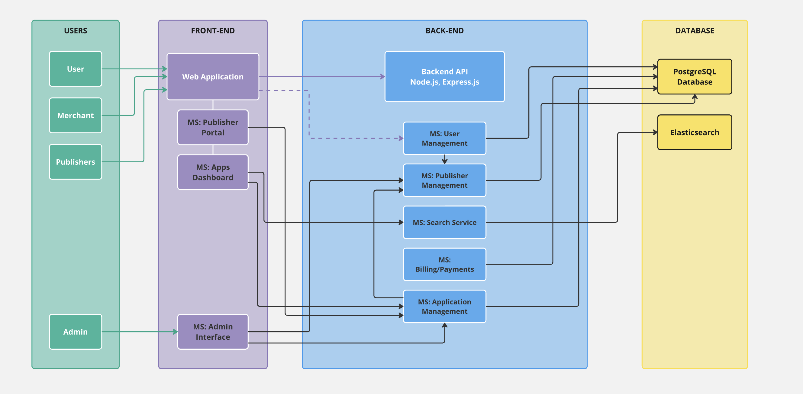
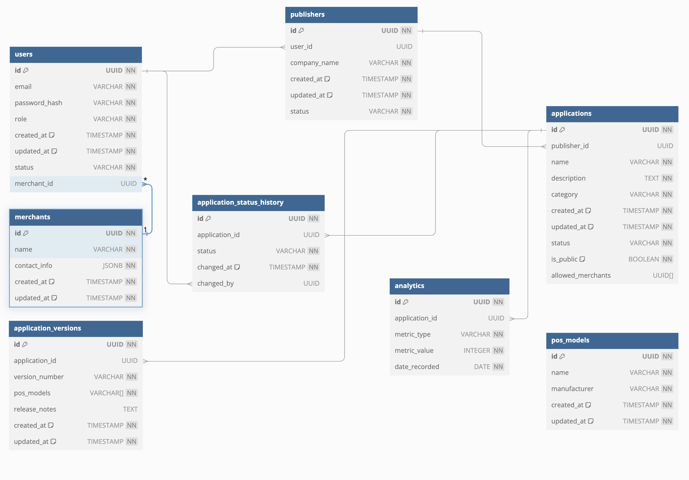

App Market
---

- [App Market](#app-market)
- [Technology Stack](#technology-stack)
- [System Architecture](#system-architecture)
- [Database Schema](#database-schema)
- [Overview](#overview)
- [Flow \& Interaction](#flow--interaction)
- [API Endpoints](#api-endpoints)
  - [Authentication \& User Management](#authentication--user-management)
  - [Publisher Management](#publisher-management)
  - [Application Management](#application-management)
  - [Application Version Management](#application-version-management)
  - [Application Status History](#application-status-history)
  - [Analytics](#analytics)
  - [POS Models Management](#pos-models-management)
  - [Merchant Management](#merchant-management)
  - [Admin Operations](#admin-operations)
  - [Search and Filter](#search-and-filter)

---

## Technology Stack

| **Category**                  | **Technologies**                                           |
| ----------------------------- | ---------------------------------------------------------- |
| **Frontend**                  | React.js, Vite.js, Zustand, Ant Design or Material-UI      |
| **Backend**                   | Node.js + Express.js, PostgreSQL, Elasticsearch            |
| **DevOps & CI/CD**            | Docker, CI/CD (based on SCM: GitHub Actions, GitLab CI/CD) |
| **Monitoring**                | Datadog                                                    |
| **Security & Authentication** | JWT (JSON Web Tokens)                                      |
| **Testing**                   | Jest, Cypress, Storybook                                   |

---

## System Architecture

The architecture diagram shows the interaction between different microservices in the backend, micro frontends in the frontend, databases, and the various roles of users (Admin, Publisher, Merchant, User). The system is designed to be modular, allowing independent development and deployment of each microservice and frontend component.

---

## Database Schema

The database schema diagram provides a detailed look at the relational structure of the database. It includes tables for managing users, applications, application versions, publishers, merchants, and application status histories. The schema is designed to ensure data integrity and efficient querying, with clear relationships between each table.

---

## Overview

1. **Frontend**

   - The **Web Application:** is the main interface where users, merchants, and publishers interact with the App Market. It's built using React.js and Vite.js, with Ant Design or Material-UI (MUI) for the UI components (TBD). Zustand is used for state management as it's easy to use, setup and scale.

   - The frontend is split into smaller, independently deployable modules (micro frontends) like the Publisher Portal, Apps Dashboard, and Admin Interface. Each module has a dedicated role, making it easier for publishers to manage their applications, for users to browse the market, and for admins to oversee the whole platform.

2. **Backend**

   - The backend is made up of several microservices built with Node.js and Express.js. Each microservice focuses on a specific domain. This modular approach makes sure each service can be developed, deployed, and scaled independently without affecting the others.

   - JWT (JSON Web Tokens) is used throughout the backend for secure authentication and authorization.

   - **Databases:** The system relies on PostgreSQL as the main relational database for storing things like user data, application details, and status histories. Elasticsearch is also integrated, handling complex search queries quickly and efficiently.

3. **DevOps & Monitoring:**

   - **Docker** The entire application will containerized with Docker to ensure consistency across development, testing, and production environments.

   - **CI/CD** pipelines will be set up using platforms like GitHub Actions or GitLab CI/CD, depending on which source control system we're using.

   - **Monitoring:** Datadog is great tool we can use for monitoring the health, performance, and security of the application.

---

## Flow & Interaction

- **User Journey:** Users, merchants, and publishers all interact with the App Market through the Web Application. Depending on their role, they might access specific micro frontends, like the Publisher Portal for managing apps, or the Admin Interface for approving or rejecting submissions.

- **Backend Processing:** Every request from the frontend is routed through the Backend API, which coordinates with the relevant microservices to get the job done. Data is stored and retrieved from PostgreSQL, while search queries are handled by Elasticsearch.

---

## API Endpoints

### Authentication & User Management

| **Method** | **Endpoint**         | **Description**                |
| ---------- | -------------------- | ------------------------------ |
| **POST**   | `/api/auth/register` | Register a new user            |
| **POST**   | `/api/auth/login`    | Log in a user                  |
| **GET**    | `/api/users`         | Retrieve all users             |
| **GET**    | `/api/users/:id`     | Retrieve a specific user by ID |
| **PUT**    | `/api/users/:id`     | Update user details by ID      |
| **DELETE** | `/api/users/:id`     | Delete a user by ID            |

### Publisher Management

| **Method** | **Endpoint**          | **Description**                     |
| ---------- | --------------------- | ----------------------------------- |
| **POST**   | `/api/publishers`     | Register a new publisher            |
| **GET**    | `/api/publishers`     | Retrieve all publishers             |
| **GET**    | `/api/publishers/:id` | Retrieve a specific publisher by ID |
| **PUT**    | `/api/publishers/:id` | Update publisher details by ID      |

### Application Management

| **Method** | **Endpoint**            | **Description**                       |
| ---------- | ----------------------- | ------------------------------------- |
| **POST**   | `/api/applications`     | Submit a new application              |
| **GET**    | `/api/applications`     | Retrieve all applications             |
| **GET**    | `/api/applications/:id` | Retrieve a specific application by ID |
| **PUT**    | `/api/applications/:id` | Update application details by ID      |
| **DELETE** | `/api/applications/:id` | Delete an application by ID           |

### Application Version Management

| **Method** | **Endpoint**                                 | **Description**                                  |
| ---------- | -------------------------------------------- | ------------------------------------------------ |
| **POST**   | `/api/applications/:id/versions`             | Submit a new version for an application          |
| **GET**    | `/api/applications/:id/versions`             | Retrieve all versions for a specific application |
| **GET**    | `/api/applications/:id/versions/:version_id` | Retrieve a specific version by version ID        |
| **PUT**    | `/api/applications/:id/versions/:version_id` | Update a specific version                        |
| **DELETE** | `/api/applications/:id/versions/:version_id` | Delete a specific version                        |

### Application Status History

| **Method** | **Endpoint**                           | **Description**                                    |
| ---------- | -------------------------------------- | -------------------------------------------------- |
| **GET**    | `/api/applications/:id/status-history` | Retrieve status history of an application          |
| **POST**   | `/api/applications/:id/status-history` | Add a new status entry to an application's history |

### Analytics

| **Method** | **Endpoint**                      | **Description**                                    |
| ---------- | --------------------------------- | -------------------------------------------------- |
| **GET**    | `/api/analytics`                  | Retrieve analytics data                            |
| **GET**    | `/api/applications/:id/analytics` | Retrieve analytics data for a specific application |

### POS Models Management

| **Method** | **Endpoint**          | **Description**                     |
| ---------- | --------------------- | ----------------------------------- |
| **GET**    | `/api/pos-models`     | Retrieve all POS models             |
| **POST**   | `/api/pos-models`     | Add a new POS model                 |
| **GET**    | `/api/pos-models/:id` | Retrieve a specific POS model by ID |
| **PUT**    | `/api/pos-models/:id` | Update a specific POS model by ID   |
| **DELETE** | `/api/pos-models/:id` | Delete a POS model by ID            |

### Merchant Management

| **Method** | **Endpoint**         | **Description**                    |
| ---------- | -------------------- | ---------------------------------- |
| **GET**    | `/api/merchants`     | Retrieve all merchants             |
| **GET**    | `/api/merchants/:id` | Retrieve a specific merchant by ID |
| **PUT**    | `/api/merchants/:id` | Update merchant details by ID      |

### Admin Operations

| **Method** | **Endpoint**                          | **Description**                                |
| ---------- | ------------------------------------- | ---------------------------------------------- |
| **GET**    | `/api/admin/pending-publishers`       | Retrieve all pending publishers for approval   |
| **PUT**    | `/api/admin/publishers/:id/approve`   | Approve a publisher                            |
| **PUT**    | `/api/admin/publishers/:id/reject`    | Reject a publisher                             |
| **GET**    | `/api/admin/pending-applications`     | Retrieve all pending applications for approval |
| **PUT**    | `/api/admin/applications/:id/approve` | Approve an application                         |
| **PUT**    | `/api/admin/applications/:id/reject`  | Reject an application                          |

### Search and Filter

| **Method** | **Endpoint**               | **Description**                |
| ---------- | -------------------------- | ------------------------------ |
| **GET**    | `/api/search/applications` | Search and filter applications |
| **GET**    | `/api/search/publishers`   | Search and filter publishers   |
